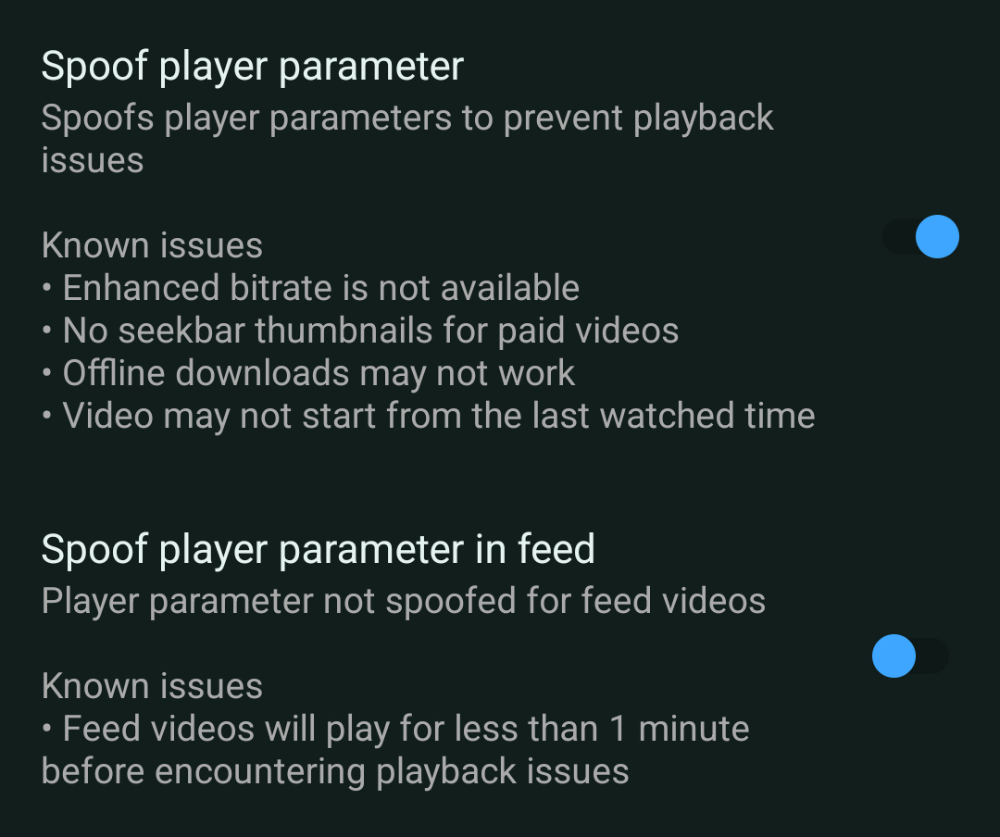

# Fix YouTube Buffering

!!!
This guide is only for ReVanced Apps | MMT TG users
!!!

- Navigate to YouTube Settings -> ReVanced Extended -> Miscellaneous
- Find `Spoof Player Parameter` & Turn it on

There are some side effects. Make sure you read it(Known Issues).
