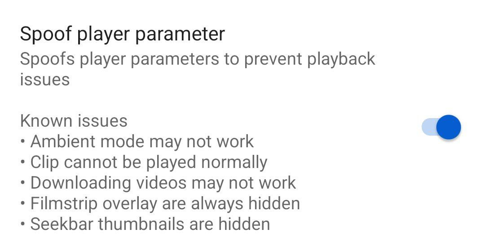
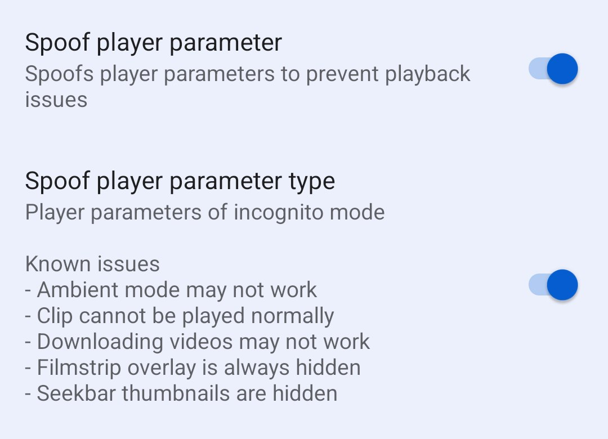

# Fix YouTube Buffering

!!!
This guide is only for ReVanced Apps | MMT TG users
!!!

==- Version 18.30.37
- Navigate to YouTube Settings -> ReVanced Extended -> Miscellaneous
- Find `Spoof Player Parameter` & Turn it on

There are some side effects. Make sure you read it(Known Issues).

===

==- Version 18.32.37 & above
- Navigate to YouTube Settings -> ReVanced Extended -> Miscellaneous
- Find `Spoof Player Parameter` & Turn it on
- Go & Watch a video.
- If the video still buffering
- Turn on `Spoof Player parameter type`

There are some side effects. Make sure you read it(Known Issues).

===