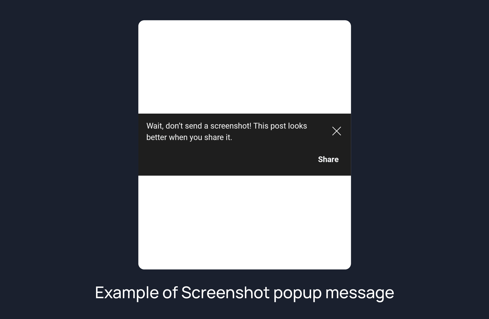
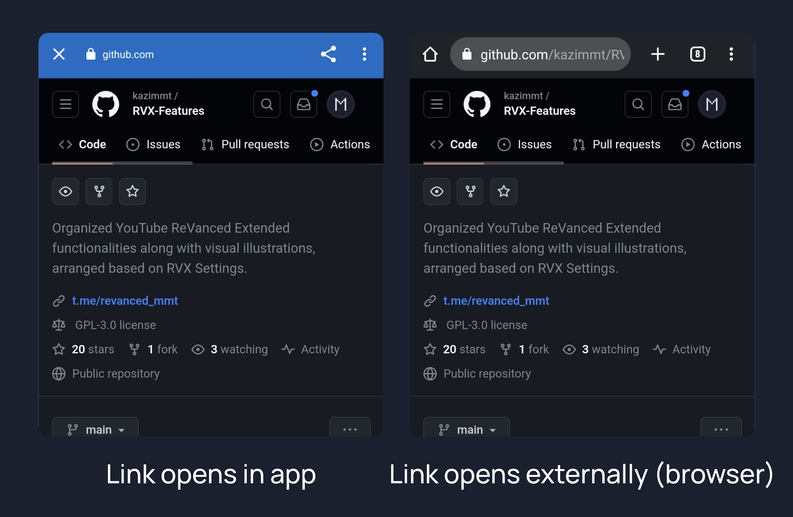
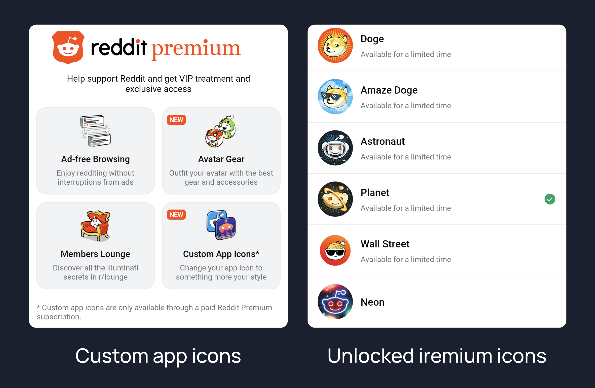
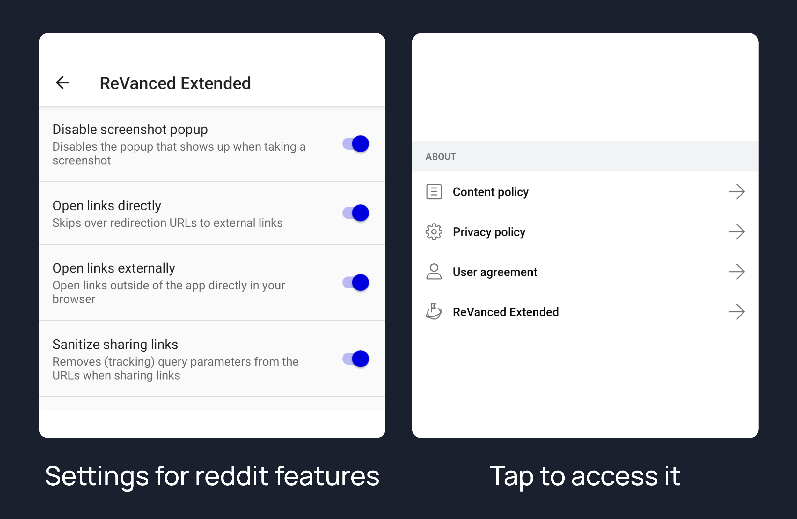

# Reddit ReVanced + Extended

## Organized Reddit ReVanced & ReVanced Extended functionalities along with visual illustrations, arranged alphabetically.

 👈 <code><i> Click arrows to expand/collapse details on this page </i></code>

### Disable screenshot popup

>Disables the popup that shows up when taking a screenshot.

>No longar valid since reddit 2023.27.xx

### Hide ads

>Hides ads from the Reddit.

### Open Links Directly

>Skips over redirection URLs to external links.

### Open Links Externally

>Open links outside of the app directly in your browser.

### Premium icon

>Unlocks premium icons.

### Reddit Settings

>Adds ReVanced Extended settings to Reddit.

### Sanitize Sharing Links

>Removes (tracking) query parameters from the URLs when sharing links.

If you  want to patch other reddit client with your own outh id
#### Follow this guide by decipher3114
[Make Reddit clients alive again !!!](https://gist.github.com/decipher3114/4423a2671dc3ce4401025b737d5c89f4)